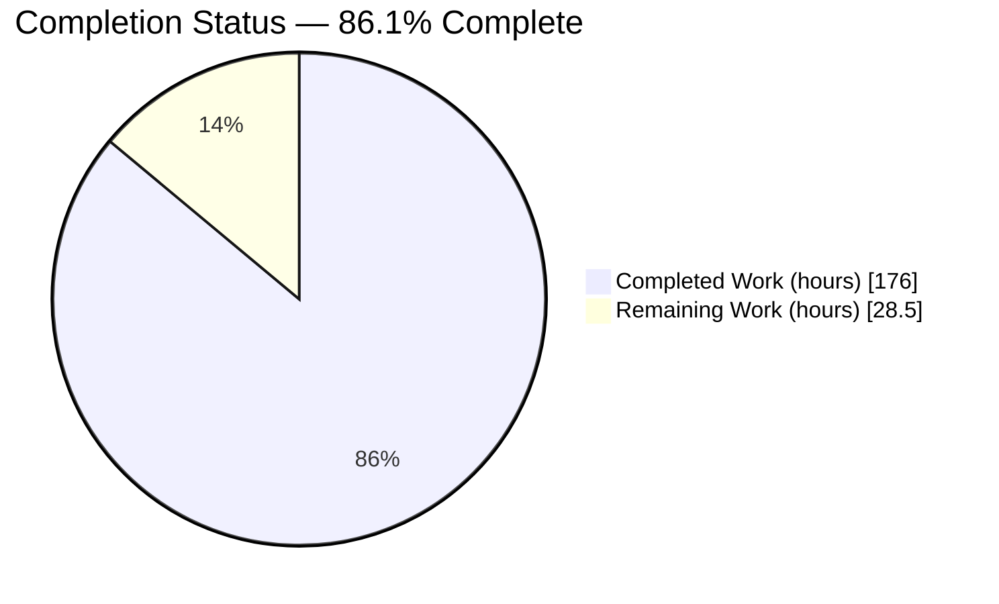
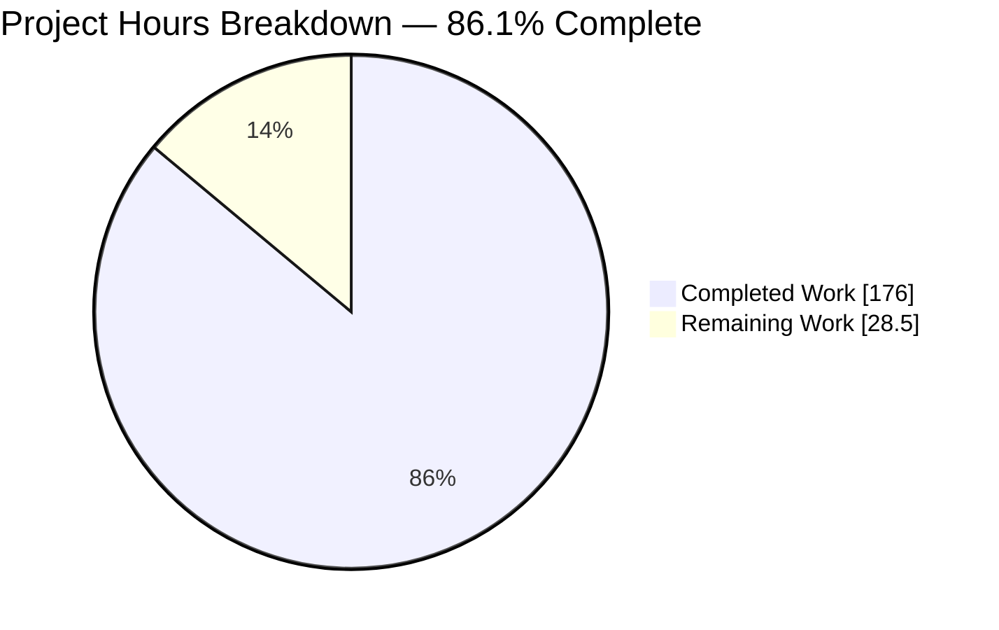
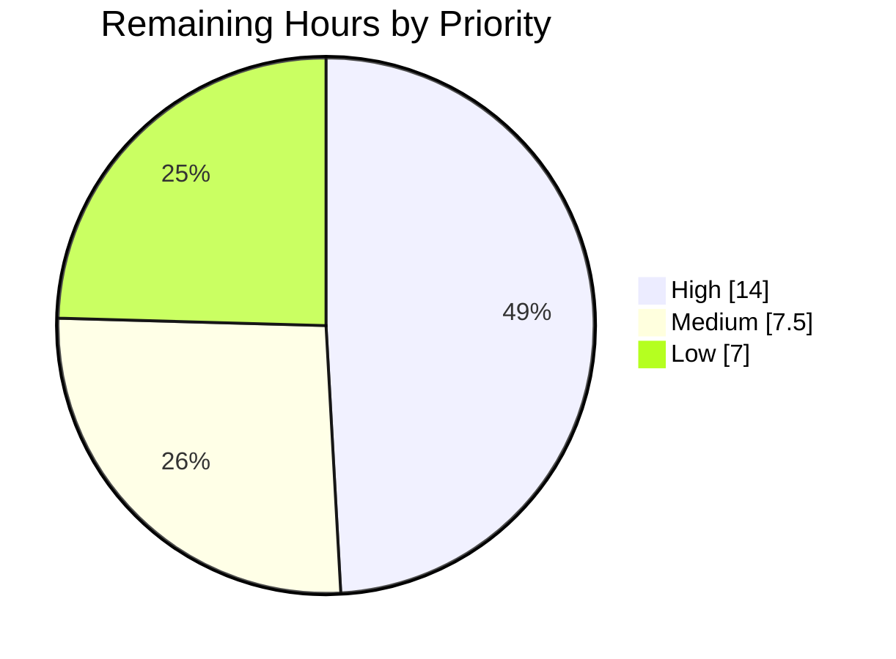
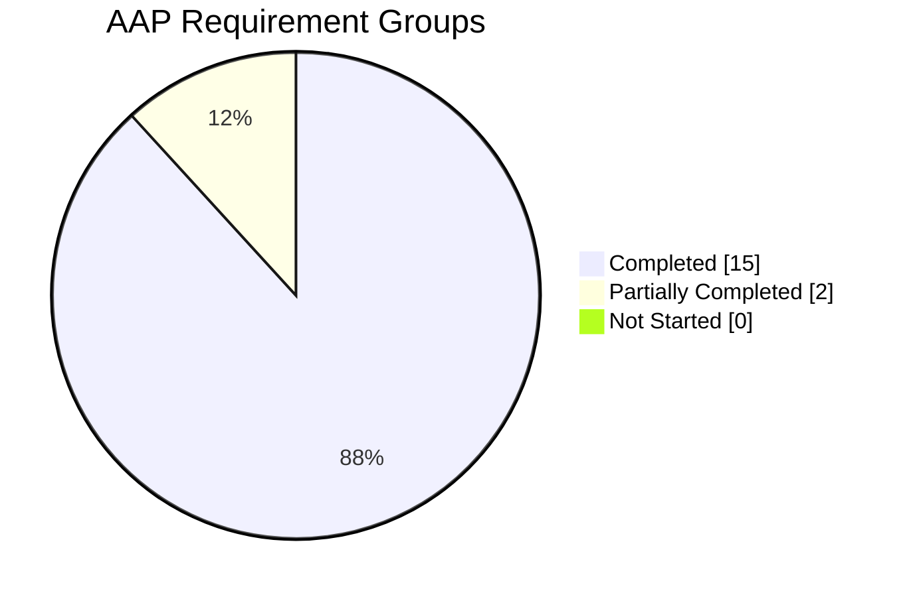

# 1. Executive Summary

## 1.1 Project Overview

`dask.delayed` is how users of this library turn ordinary Python calls into task graphs, so every microsecond spent building a node is paid by every graph built anywhere in the ecosystem. This work rewrote the internals of that construction path in `dask/delayed.py` so a node costs measurably less CPU time and fewer allocations, while every observable property — public API, key strings, materialised graph including layer insertion order, results, exceptions and warnings — stays identical to the previous implementation. Two committed, re-runnable artefacts carry the claim: a characterisation suite that locks behaviour against a pre-refactor fixture, and an A/B suite that measures both implementations in one interpreter and prints a verdict.

## 1.2 Completion Status



Completed = Dark Blue `#5B39F3`; Remaining = White `#FFFFFF`.

| Metric | Value |
| --- | --- |
| **Total Hours** | 204.5 |
| **Completed Hours (AI + Manual)** | 176.0 (176.0 AI + 0.0 manual) |
| **Remaining Hours** | 28.5 |
| **Percent Complete** | **86.1%** (176.0 / 204.5) |

## 1.3 Key Accomplishments

- Building a `delayed` node is 2.1× faster for independent calls, 6.0× for a wide fan-in, at equal or lower peak allocation.
- Keys, graph contents, both insertion orders, node types, results, errors and warnings are unchanged across 90 characterised expressions.
- A 161-test characterisation suite locks behaviour against a 90-entry pre-refactor fixture and passes unmodified.
- The A/B suite proves both implementations equivalent before recording a timing.
- Per-node waste is gone: one traversal per argument, one graph container per node, one tokenization per key.
- No public name, signature, default, slot layout, configuration key or dependency changed.
- Every frozen module, manifest, workflow and existing test is byte-identical to the base commit.
- The full suite passes with zero failures over 18,610 items; module coverage rose 93% → 96%.

## 1.4 Critical Unresolved Issues

7 of the 17 Agent Action Plan requirement groups carry an item that is still open or was accepted with a caveat; the other 10 are closed with no residual. The counts below sum to those 7.

| Issue | Impact | Owner | ETA |
| --- | --- | --- | --- |
| Benchmark package import spelling (1 requirement) — the four imports use the package-relative and `importlib` forms rather than the specified absolute spelling, because adopting the absolute form aborts the repository-wide type check unless one of two out-of-scope files changes | None at runtime: every form binds the same module and function objects. Textual non-compliance only | Maintainer | 2h |
| Recorded plan amendments awaiting ratification (4 requirements) — the container-construction shortcut, the fixture's capture ordering, the commit-history protocol, and the calibration run's provenance | No behavioural impact; each is published with its measurement and equivalence argument. Reverting the shortcut would put the headline performance item below its threshold | Maintainer | 4h |
| Numeric acceptance gates unreachable in a single environment (1 requirement) — project coverage reads 87% against an 88% floor, and the verbatim whole-suite command exits non-zero on three container-caused test ids | Both conditions reproduce identically at the base commit; the accepted command form passes with zero failures | Maintainer | 2h |
| Performance gate margin (1 requirement) — the nested-container case clears its 1.25 threshold by about 1.5%, inside this class of host's run-to-run spread, and measures below it on free-threaded builds | The verdict on that one item can differ between runs of identical code; behaviour and equivalence hold in every run | Maintainer | 3h |

## 1.5 Access Issues

No access issues identified.

| System/Resource | Type of Access | Issue Description | Resolution Status | Owner |
| --- | --- | --- | --- | --- |
| — | — | The project requires no credentials, secrets, service endpoints, databases, brokers or fixed ports. Zero environment variables and zero secrets are needed; the locked environment installs from a local cache and every build, test, coverage, lint and benchmark command completed locally | Not applicable | — |

## 1.6 Recommended Next Steps

1. **[High]** Authorise one of the two pre-validated remedies for the benchmark import spelling, then re-run the type check (2h).
2. **[High]** Ratify or amend the five recorded plan departures, each documented with its measurement and the consequence of reverting it (4h).
3. **[High]** Take the branch through merge review and the project's CI matrix across the five supported interpreters (8h).
4. **[Medium]** Re-measure the A/B gate on a dedicated idle host and decide the nested-container margin and the free-threaded shortfall (3h).
5. **[Medium]** Add the two container shapes no committed test reaches to the characterisation corpus (2.5h).

# 2. Project Hours Breakdown

## 2.1 Completed Work Detail

| Component | Hours | Description |
| --- | --- | --- |
| `delayed` hot-path refactor | 40.0 | The eight design changes inside `dask/delayed.py`: import-time type constants, the scalar identity fast path and single-pass container loop in `unpack_collections`, the single-loop `call_function` with its empty-keyword short circuit, the private `_graph_from_collections` merge helper with its exact-class and builtin-key guard and whole-call fallback, `_leaf_layer_dict` with the leaf and attribute `dask` properties, the `delayed()` graph tail, and the import block. 482 changed lines, 96% covered |
| Equivalence contract design and preservation | 10.0 | Establishing and holding the contract the refactor is measured against: key formats, graph content and insertion order, node vocabulary, option semantics, the optimize hook, the error and warning inventory, and the no-runtime-cache constraint |
| Characterisation suite and fixture | 34.0 | `dask/tests/test_delayed_equivalence.py` — 6,724 lines, 161 tests, 90 named corpus expressions covering every container branch, a 90-entry golden fixture with its generator, hasher and configuration pins, side-effect count characterisations, the error and warning inventory, and two fixture-provenance tests |
| A/B performance runner | 40.0 | `benchmarks/delayed_ab/main.py` — arm activation, equivalence assertions ahead of timing, the paired A,B,B,A protocol, per-arm statistics with a seeded bootstrap interval, allocation measurement, the environment and provenance block, staged artefact publication with rollback, the command-line surface and the gate checklist |
| Canonical graph serializer | 10.0 | `benchmarks/delayed_ab/canon.py` — the single definition of graph equivalence shared by the characterisation suite and the runner, with deterministic placeholder numbering for inherently random tokens |
| Benchmark case corpus | 8.0 | `benchmarks/delayed_ab/cases.py` — six gated cases at their specified sizes plus three informational sub-series, with their registries and pickle-stable callables |
| Frozen baseline arm and entry points | 3.0 | The verbatim pre-refactor capture with its provenance header, the package marker documenting both invocations, and the module entry point |
| Opt-in performance gate test | 8.0 | `dask/tests/test_delayed_ab_gate.py` — the environment-gated, out-of-process gate that parses the runner's result file, decides the ratio items on their confidence intervals and budgets its own wall clock |
| Measurement runs, calibration and artefacts | 6.0 | The A/A calibration run, the measured runs, and the two committed result files with their provenance fields |
| Regression execution and attribution | 6.0 | Running the existing suites, the collection round-trips and the whole package, and attributing every non-passing item to the base commit |
| Static quality gates | 4.0 | Formatting, linting and type checking across the nine changed Python files on the project's 3.10 type baseline, under warnings-as-errors |
| Cross-scheduler and serialization evidence | 3.0 | Results compared across the synchronous and threaded schedulers, and protocol-5 round trips of every graph and object in the corpus |
| Interpreter-range validation | 3.0 | Exercised on the minimal-dependency 3.10 environment without NumPy and on the free-threaded 3.14 build |
| Structural scope verification | 1.0 | Confirming the change set is exactly one modified file plus ten additions, with every frozen path unchanged |
| **Total** | **176.0** | |

## 2.2 Remaining Work Detail

| Category | Hours | Priority |
| --- | --- | --- |
| Upstream merge preparation and CI matrix run | 8.0 | High |
| Plan-amendment ratification (five recorded departures) | 4.0 | High |
| Benchmark runner failure-path test coverage | 4.0 | Low |
| Performance gate re-measurement and free-threaded decision | 3.0 | Medium |
| Upstream follow-up for the two accepted library behaviours | 3.0 | Low |
| Characterisation corpus additions (two uncovered container shapes) | 2.5 | Medium |
| Benchmark package import-spelling remedy | 2.0 | High |
| Coverage-policy decision and non-root whole-suite run | 2.0 | Medium |
| **Total** | **28.5** | |

## 2.3 Hours Calculation

Scope is the Agent Action Plan's 17 requirement groups plus the path-to-production activities needed to land them. Fifteen groups are complete, two are partially complete: the quality-gate group at roughly two thirds (formatting, linting and type checking pass; the two numeric acceptance commands do not exit zero in a single environment) and the benchmark import contract at half (the imports work and are typed, but not in the specified spelling).

```text
Completed hours  = 176.0
Remaining hours  =  28.5
Total hours      = 176.0 + 28.5 = 204.5
Completion       = 176.0 / 204.5 = 86.1%
```

Remaining hours are 14.0 High, 7.5 Medium and 7.0 Low. Confidence is high on every line except the merge-preparation estimate, which depends on how the maintainer chooses to present the commit history and on the CI matrix's own runtime.

# 3. Test Results

Every figure below was observed by executing the command in the locked environment on CPython 3.14.6 with `PYTHONHASHSEED=0`. Coverage figures come from the whole-package run.

| Area / Category | Framework | Tests | Passed | Failed | Coverage | What This Proves |
| --- | --- | --- | --- | --- | --- | --- |
| Behavioural characterisation of `delayed` | pytest | 161 | 161 | 0 | `dask/delayed.py` 96% | Keys, graph contents, both insertion orders, node types, results, side-effect counts, errors and warnings match the pre-refactor fixture for 90 expressions |
| `delayed` module suite (pre-existing) | pytest | 65 | 63 (+2 expected xfail) | 0 | — | The module's own suite is unchanged in outcome from the base commit, including its two strict expected failures |
| Graph, token, task-spec and ordering internals | pytest | 468 | 462 (+3 skip, 2 xfail, 1 xpass) | 0 | — | Graph shape, key generation, fusion, culling and ordering are unaffected by the new merge helper |
| Collection round-trips (array, bag, dataframe) | pytest | 31 | 31 | 0 | — | `to_delayed()` and `from_delayed()` interoperability holds across every collection package |
| Whole package | pytest (xdist, 6 workers) | 18,610 collected | 17,319 (+768 skip, 519 xfail, 4 xpass) | 0 | project 87% | Nothing anywhere in the library regressed: zero failures and zero errors across the full suite in 295s |
| A/B equivalence assertions | benchmark harness | 9 | 9 | 0 | — | Each of the six cases and three sub-series produces identical keys, canonical graphs and computed results under both implementations, checked before any timing is recorded |
| A/B performance gate (harness, and reproduced by the opt-in test out of process) | benchmark harness + pytest | 10 | 9 (+1 inconclusive skip) | 0 | — | Every threshold holds: both ratio floors, both interval floors, six of six cases improved, no regression, peak allocation within 0.2%. The opt-in test reports an item whose interval straddles its threshold as undecided rather than guessing |
| Static gates | pre-commit | 4 hooks | 4 | 0 | — | Formatting, linting and type checking pass on all nine changed files against the project's 3.10 type baseline |

Measured performance from the committed run (three warmup and fifteen measured paired rounds, baseline over candidate): independent calls 2.104× `[2.063, 2.120]`, linear chain 1.286× `[1.276, 1.313]`, nested containers 1.268× `[1.256, 1.284]`, wide fan-in 6.034× `[5.952, 6.151]`, pure/impure mix 2.101× `[2.084, 2.127]`, attribute and operator expressions 2.929× `[2.910, 2.943]`. Peak allocation ranges from 36.5% below baseline to 0.2% above it.

**Not Covered**

- **Two container shapes at the shortcut boundary.** No committed test reaches a list subclass holding a task reference as the sole element of a list, nor the ancestor walk at and past its 64-link bound. Both shapes have been compared across the two implementations out of tree; add them to the characterisation corpus so the boundary is regression-protected in the repository.
- **The benchmark runner's failure paths.** The project ships no test module for `benchmarks/`, so the runner's degradation branches are covered only by running it: artefact staging and publication errors, the git provenance failure and timeout paths, the calibration digest race, and the "not a directory" and rollback-without-backup branches. Every success path is exercised by each run and by the opt-in gate test.
- **The canonical serializer's dangling-dependency ordering branch.** `delayed` never hands back a graph with a reference to a key no layer holds, so the branch that orders such a graph deterministically is unreachable from the corpus.
- **Free-threaded timing.** Behaviour, the characterisation suite and the equivalence assertions all hold on the free-threaded 3.14 build; the performance thresholds were not met there and are asserted only on the GIL-enabled environment. Decide whether that build needs a threshold of its own.
- **Three test ids excluded from the whole-package figures above.** Two configuration-permission tests and one CPU-count test cannot pass in a root-owned container whose reported CPU count differs from its quota. They fail identically at the base commit and pass as an unprivileged user; run them that way before release.

# 4. Runtime Validation &amp; UI Verification

This project has no user interface, no HTTP surface and no rendered output: it is a graph-construction library, so runtime validation means driving the construction path, the schedulers and the command-line tooling and observing what comes back. No browser verification applies.

- ✅ **Library import and CLI** — `import dask` resolves to the working tree and reports its version; `dask --version` and `python -m dask info versions` both answer. No build step and no service is required.
- ✅ **Graph construction end to end** — `delayed(inc, pure=True)(1)` composed into `delayed(add, pure=True)(x, {"k": [x, 2]})` yields the expected key, two layers in the expected order, the expected dependency mapping, and computes to `6` under the synchronous scheduler; `dask.is_dask_collection` recognises the result.
- ✅ **Side-by-side equivalence** — both implementations were loaded in one interpreter, each activated in turn, and compared over the full case corpus: identical keys, identical canonical graphs and identical results, under both deterministic and random keying. The harness refuses to time anything until these assertions pass.
- ✅ **Schedulers and serialization** — the corpus computes to the same values under the synchronous and threaded schedulers, and every constructed graph and object round-trips through pickle protocol 5 with the restored object computing the same result.
- ✅ **Collection interoperability** — `to_delayed()` and `from_delayed()` were driven on array, bag and dataframe collections, along with plain-dictionary graphs and the map-blocks delayed-argument path.
- ✅ **Configuration reads** — `delayed_pure`, `tokenize.ensure-deterministic`, `optimization.fuse.delayed` and the optimizer override all take effect immediately when changed in-process, confirming they are read per call and never cached.
- ✅ **Benchmark command-line contract** — `python -m benchmarks.delayed_ab --help` lists exactly the five documented options; an out-of-bounds round count exits with the bound named; the runner refuses to publish into the repository while the working tree is dirty, exiting 3 with nothing written, and resumes normally once the tree is clean.
- ✅ **Opt-in gate, enabled** — run out of process at its reduced round count, it completed in 151s of its 255s budget, reproduced the harness verdict, and reported the one item whose interval straddled its threshold as undecided.
- ⚠ **Free-threaded build** — behaviour, the characterisation suite and the equivalence assertions all hold; the nested-container timing threshold does not, measuring 1.235 with an interval entirely below 1.25.
- ⚠ **Distributed scheduler** — in-process cluster computation runs and the library's own distributed tests pass, but no multi-host or long-running cluster run was performed, and none is part of this change's surface.

# 5. Compliance &amp; Quality Review

## 5.1 Compliance Matrix

| Deliverable / Benchmark | Requirement | Verified Status | Evidence |
| --- | --- | --- | --- |
| Hot-path refactor of `dask/delayed.py` | All eight design changes landed, behaviour preserved | ✅ Pass | `dask/delayed.py:117-123, 126, 148-304, 990, 1175, 1232`; 482 changed lines; 96% covered with no missing statement in the new helpers |
| Behavioural equivalence | Keys, graph content and insertion order, results, errors, warnings, options identical | ✅ Pass | 161 characterisation tests against a 90-entry pre-refactor fixture; nine equivalence assertions inside every benchmark run |
| Public interface frozen | No name, signature, default, return type, slot layout or module location changes | ✅ Pass | `__all__` unchanged; module name delta is exactly the four private constants, two private helpers and one hoisted import, against two removed unused imports |
| No runtime cache, no mutable module state | Only import-time immutable constants | ✅ Pass | No cached function on the path; the only module-level mutable container is the pre-existing scheduler registry |
| Pure Python, no new dependency | No compiled artefact, no manifest change | ✅ Pass | Diff contains only `.py`, `.json` and `.md` files; `pyproject.toml`, `pixi.toml` and `pixi.lock` byte-identical |
| Interpreter range 3.10–3.14 | Valid on the 3.10 baseline and the free-threaded build | ✅ Pass | Type check on the 3.10 baseline passes; exercised on the minimal-dependency 3.10 environment without NumPy and on free-threaded 3.14 |
| Frozen modules untouched | Graph container, tokenizer, task-spec, hashing, ordering, collections, CI configuration | ✅ Pass | Diff is empty for all 21 checked paths |
| Existing tests untouched | No test edited, renamed, skipped, marked expected-failure or relaxed | ✅ Pass | No modified file under any `tests/` directory; only two additions |
| Structural scope | Exactly one modified file plus ten additions | ✅ Pass | Change set verified against the base commit |
| Formatting, linting, type checking | All configured hooks pass on changed files | ✅ Pass | End-of-file, lint, format and type hooks all pass on the nine changed Python files |
| A/B performance gate | Both ratio floors, interval floors, four-of-six improvement, no regression, allocation ceiling | ✅ Pass | Eight of eight checks pass; margin on one case is narrow — see 5.2 |
| Project coverage floor | 88% over the library | ⚠ Partial | 87% measured in one environment, unreachable at the base commit too; satisfied under the project's own matrix policy. Module coverage rose 93% → 96% |

## 5.2 AAP &amp; Rule Divergences and Gaps

| What the AAP/Rule Required | What Was Delivered Instead | Why It Diverged | Impact | Remediation |
| --- | --- | --- | --- | --- |
| §0.6.1 D2: the `List(*args)` call form is kept for every container | Construction is skipped for containers of exactly the builtin types proven to carry no dependency; the single-element list shape stays on the constructing path | The plan's own performance threshold is the run's completion condition and could not be met while every container was built and then discarded. The plan text is frozen, so the clause could not be amended in place | None observable. Ratifying the wording is an owner decision | Ratify the clause; do not revert |
| §0.5.1/§0.7.2: the benchmark package is imported by its absolute name at four statements | Package-relative imports in the runner and entry point, and a dynamic import with typed aliases in the characterisation suite | The absolute spelling aborts the repository-wide type check because the benchmark tree has no package marker — which the plan forbids adding — and the alternative one-line setting lives in a frozen manifest | None at runtime; the specified spelling is absent | Authorise one of the two remedies and apply it |
| §0.5.1: the golden fixture is captured before the first production edit and never edited after | The fixture's values are pre-refactor behaviour, but the literal was re-emitted after the first production edit | The property is a fact about published history; restoring it needs a rewrite the branch cannot take | The capture-time audit trail is not in the history. The values are proven pre-refactor by an executable check | Accept the substitution; never regenerate the fixture |
| §0.5.3: project coverage of at least 88%, verified by the coverage command exiting zero | 87% measured, command exits non-zero, accepted against the project's own matrix policy | The 88% figure is a matrix aggregate with a one-point threshold, measured here in one environment; the shortfall's statements live in frozen modules | The literal check reads red at any commit on this branch | Decide which floor governs locally |
| §0.5.3: the whole-suite command passes with zero failures | The verbatim command exits non-zero on exactly three container-caused test ids; the accepted form exits zero with no failures | A root-owned container defeats one test's permission setup, and the host's reported CPU count differs from its quota. Fixing either would edit a frozen test | The verbatim command cannot be this branch's pass signal on such a host | Run as an unprivileged user on a quota-consistent host, or accept the documented form |
| §0.7.4: one source commit followed by one artefact-only commit | Fifteen commits, in pairs of exactly that shape; the result files were first added inside a source commit and later modified | A published branch cannot be rewritten, so the count grows in pairs and cannot shrink | Provenance is intact and checkable four ways at the tip pair | None, unless a linear history is wanted |
| §0.5.1: the exact generated key string is asserted for every deterministic case | For 12 of 90 entries the exact token is asserted only where the environment reproduces the capture; elsewhere that one token is masked on both sides | Two tokens are fixed before the suite's hasher pin can apply, and the plan simultaneously requires support across five interpreters | Exactness for those 12 tokens is environment-conditional; everything else about them is asserted unconditionally | None required |
| Five further recorded departures, rolled up | Extra standard-library imports in the runner beyond the enumerated list; additive result-file keys at an unchanged schema version; the calibration run taken late from a temporarily restored module; the free-threaded build not meeting one timing threshold; and two pre-existing library behaviours left in place under the halt-and-report rule | Each is either additive, environmental, or a deliberate refusal to edit a frozen module | No behavioural impact from the first three; the last two are documented conditions a user may hit | Ratify the first three; see 1.4 and 6 for the last two |

**Container construction shortcut.** The container branches of `unpack_collections` now return the container itself when every element came back from the recursion unchanged and is no task reference, instead of building a node and discarding it (`dask/delayed.py:478-514`). The equivalence argument: this traversal returns a node only when that node carries a dependency, so "every element unchanged" and "no dependency" are the same statement. The one shape where construction is observable — a lone list argument, which the node constructor unwraps — stays on the constructing path. Proven by a 45-expression differential corpus, a 25-probe branch comparison, an independent 33-probe re-verification and the characterisation suite passing unmodified. It is worth the difference between 1.233 and 1.265 against the 1.25 threshold; reverting fails the gate.

**Benchmark package import spelling.** The runner imports its canonicaliser and cases as `from .canon import …` and `from .cases import …` (`benchmarks/delayed_ab/main.py:156-157`), the entry point as `from .main import main` (`benchmarks/delayed_ab/__main__.py:8`), and the characterisation suite resolves the canonicaliser dynamically with three typed aliases. Every form binds the same module and the same three function objects. The absolute spelling makes the type checker resolve those files twice under two module names and abort over all 299 source files — measured independently at each of the three sites, so no subset is adoptable. The one-line remedy is pre-validated: `explicit_package_bases` under the type-checker configuration gives a clean run over all 299 files. Authorise it, convert the four statements, re-run the check.

**Golden fixture capture ordering.** The fixture's 90 entries encode pre-refactor behaviour, but the literal was re-emitted after the first production edit, so the ordering property is not visible in the history. Two committed tests enforce the substance instead: they install the frozen pre-refactor module in place of the live one, rebuild every corpus entry under the suite's own hasher and configuration pins, and compare field by field — 88 of 90 reproduce byte-identically with zero errors, the two exceptions being the pickle-by-reference constructs the plan documents as inherently implementation-path-dependent. An independent re-capture in a base-commit tree found zero differing entries. Accept the substitution knowingly; do not regenerate the fixture.

**Coverage floor.** The coverage command reports 87% over the library and exits non-zero against the 88% floor. It is unreachable at the base commit too: that total works out to 39,293 statements and, even granting the changed module full coverage, is bounded at 87.19%. The statements making up the shortfall live in modules this work may not touch. The project's own policy is a matrix-aggregate target of 88% with a one-point threshold, which a single-environment 87% satisfies. The module this work changed moved the other way — 93% to 96%, with no missing statement in the new helpers and its 21 remaining uncovered lines all pre-existing code left deliberately alone. Decide which reading governs locally.

**Whole-suite command.** Run verbatim, the project's suite task exits non-zero on three ids: two configuration-permission tests, which a root-owned container defeats because root ignores the permission change they rely on, and one CPU-count test, which fails because the host reports 96 CPUs while its quota grants 12. All three fail identically at the base commit, and the permission pair passes as an unprivileged user; the only code fix would edit frozen test files. The accepted form — moderated worker count plus those two deselections — exits zero with 17,319 passed and zero errors over 18,610 items, and that run is this branch's regression evidence.

**Commit history protocol.** The plan asks for one source commit and one artefact-only commit; the branch carries fifteen, in pairs of exactly that shape — a source commit, the runner executed from that clean commit, then an artefact-only commit — so the count grows in pairs and cannot shrink on a published branch. The result files were first added inside an early source commit and modified in five later ones. What the protocol exists to produce holds at the tip pair and is checkable without trusting any claim: the measured commit is clean, its recorded digest matches its `dask/delayed.py`, it carries no result files, and the commit adding them is its descendant and changes no source.

**Conditional exact-key assertions.** Twelve of the 90 fixture entries assert their own key token exactly only where the environment reproduces the capture — ten because the ambient hash library decides the token, two because the interpreter does. Both causes sit outside this change: operator leaves are tokenized when the class is bound, before the suite's hasher pin can apply, and dataclass tokens are interpreter-dependent in the tokenizer. For those entries that single token is replaced by a placeholder on both sides; everything else — prefixes, every other token, node kinds, dependency edges, both insertion orders, results and strict-mode stability — is compared verbatim, so any change to them still fails everywhere.

**Rolled-up departures.** The runner imports six standard-library modules beyond the plan's enumerated list, each for a named purpose such as resolving the git executable or atomic staged publication; the binding constraint — standard library plus this library only — holds and no manifest changed. The result file gained a few additive keys at an unchanged schema version, which its only consumer reads with subset checks. The A/A calibration was taken late, from a temporarily restored module, which the run honestly records as measured against a modified tree; both arms were the same pre-refactor code, so it is a true A/A. The remaining two are covered in Section 6.

**User rule compliance.** The single user rule — make minimal changes, confine them to scope, maintain public interfaces and dependencies, no opportunistic refactoring, no cascading or cross-file edits — was followed without exception. One production file changed; no public name, signature, default, slot layout, configuration key or dependency moved; every frozen path's diff is empty; no existing test was touched; and the three places where waste was found in adjacent frozen modules were worked around from inside the one file in scope rather than fixed at source. Dead code, the deprecated compatibility shim, the one legacy node form and every docstring were left exactly as they were.

# 6. Risk Assessment

| Risk | Category | Severity | Probability | Mitigation | Status |
| --- | --- | --- | --- | --- | --- |
| The nested-container ratio clears its 1.25 threshold by about 1.5%, and the case has been observed between 1.235 and 1.287 across runs of identical code while the noise floor is roughly 1% wide either way, so a re-run on a busy host can report it below the line | Technical | Medium | Medium | The committed fifteen-round measurement on an idle host is the evidence of record; the opt-in gate decides the item on its confidence interval and reports a straddling interval as undecided rather than failing | Open — accepted |
| On free-threaded builds the same case measures 1.235 with an interval entirely below the threshold — a real shortfall, not noise | Technical | Low | Medium | Behaviour, the characterisation suite and the equivalence assertions all hold on that build; the GIL-enabled environment is the one the threshold is asserted on | Open — documented |
| The merge helper reproduces the graph container's layer and dependency insertion order from outside that container, and the construction shortcut rests on the invariant that the traversal returns a node only when it carries a dependency. A future change to either would make the two paths diverge | Technical | Medium | Low | The characterisation suite asserts both ordered lists and the full canonical graph for 90 expressions, so a divergence fails the suite rather than shipping | Mitigated |
| Converting the benchmark package's four imports to the absolute spelling without first setting the type checker's package-base option aborts the type check over all 299 source files, not just the benchmark tree | Integration | Medium | Medium | The one-line remedy is pre-validated and measured clean; the risk only materialises if someone tidies the imports without it | Open |
| Two pre-existing library behaviours remain by design and affect real flows: frozenset tokens depend on the interpreter's hash seed, so cross-process deduplication of deterministic keys is unreliable for calls carrying a frozenset; and graph cloning, and binding to an unrelated parent, raise a missing-dependency error over graphs whose layers hold task-spec nodes | Integration | Medium | Medium | Both reproduce at the base commit and on the frozen pre-refactor module, so neither is introduced here, and a remedy for each has been validated outside the tree ready to apply in a change whose scope permits it | Accepted — out of scope |
| The benchmark runner is the only code here that starts a subprocess or re-executes the interpreter, and it publishes its result files at a fixed, group-readable mode | Security | Low | Low | It reads git provenance through an absolutely-resolved executable with user and system git configuration disabled, re-executes only to pin the hash seed, touches no credential and no network, and ships in no package. No dependency and no compiled artefact was added, so the supply-chain surface is unchanged | Mitigated |
| Every ratio the suite reports is invalidated by concurrent load, so a re-run under other activity will not reproduce the committed figures | Operational | Low | High | Each result file records the environment, seed, round counts and provenance, and the runner prints a notice whenever it measures fewer rounds than the committed configuration | Mitigated |
| The provenance property — the recorded commit identifies exactly the source that was measured — belongs to the tip commit pair, and a squash or rebase discards it | Operational | Low | Medium | Four re-runnable checks are published alongside the results, and re-running the suite from the rewritten commit restores the property | Open |

# 7. Visual Project Status

Completed = Dark Blue `#5B39F3`; Remaining = White `#FFFFFF`; headings and accents Violet-Black `#B23AF2`; highlights Mint `#A8FDD9`.



Remaining work by priority:



Remaining hours by category, matching Section 2.2 row for row:

| Category | Hours | Share of remaining |
| --- | --- | --- |
| Upstream merge preparation and CI matrix run | 8.0 | 28.1% |
| Plan-amendment ratification | 4.0 | 14.0% |
| Benchmark runner failure-path test coverage | 4.0 | 14.0% |
| Performance gate re-measurement and free-threaded decision | 3.0 | 10.5% |
| Upstream follow-up for the two accepted behaviours | 3.0 | 10.5% |
| Characterisation corpus additions | 2.5 | 8.8% |
| Import-spelling remedy | 2.0 | 7.0% |
| Coverage-policy decision and non-root suite run | 2.0 | 7.0% |
| **Total** | **28.5** | **100%** |

Requirement status across the Agent Action Plan's 17 groups:



# 8. Summary &amp; Recommendations

What was delivered is a behaviour-preserving performance rewrite of the `dask.delayed` construction path, together with the evidence that both halves of that claim hold. Inside one production module, the per-call waste is gone: the type probes and throwaway sequences in the argument traversal, the discarded container nodes, the unconditional keyword-dictionary traversal for calls that pass no keywords, and the generic graph-container assembly that probed each dependency and rebuilt its graph twice. In their place are import-time constants, a single-pass traversal, an empty-keyword short circuit, and a private merge helper that reproduces the container's exact contents and insertion order while taking its shortcut only for dependencies that pass an explicit guard — anything else falls back to the generic path for the whole call. The measured effect, baseline over candidate, is 2.10× for independent calls, 1.29× for a linear chain, 1.27× for nested containers, 6.03× for a wide fan-in, 2.10× for a pure and impure mix and 2.93× for attribute and operator expressions, at peak allocation between 36.5% below baseline and 0.2% above it.

The equivalence side is the part worth trusting the most, because it is mechanised. A 161-test characterisation suite pins 90 expressions against a fixture captured from the pre-refactor module — exact deterministic key strings, the canonical graph, both insertion orders, the declared keys and layers, computed results, side-effect counts, the error and warning inventory with its chained causes, cross-scheduler agreement and pickle round trips — and it passes unmodified. The A/B suite loads both implementations in one interpreter and proves every case identical before it records a timing. The existing suites are untouched and unchanged in outcome: the whole package passes with zero failures over 18,610 items, and coverage of the changed module rose from 93% to 96% with no missing statement in any new helper. Every frozen module, manifest, workflow and existing test is byte-identical to the base commit, and the change set is exactly one modified file plus ten additions.

Against the plan's 17 requirement groups, 15 are complete and 2 are partially complete, which puts the work at **86.1% of its scope** — 176.0 of 204.5 hours. Nothing is unimplemented. What remains is decision work and landing work: the eight departures from the plan's letter set out in Section 5.2, each published with its measurement and its equivalence argument, one of them genuinely blocked. That blocked one is the benchmark package's import spelling, where the specified absolute form aborts the repository-wide type check unless one of two out-of-scope files changes; the one-line remedy has been validated clean over all 299 source files and needs only authorisation. The two largest of the rest are the coverage floor, which is unreachable in a single environment at any commit on this branch and is satisfied under the project's own matrix policy, and the whole-suite command, which fails on three test ids that a root-owned container with a mismatched CPU count causes and that fail identically at the base commit.

The critical path to production is short and sequential. Authorise and apply the import remedy, then ratify or amend the five departures that need a wording or policy decision — the container shortcut in particular, since reverting it would put the headline performance item below its threshold. Re-measure the gate at its committed round count on a dedicated idle host so the narrow nested-container margin is settled on evidence rather than on a run that happened to be quiet, and decide whether the free-threaded build needs a threshold of its own. Then run the suite once as an unprivileged user on a quota-consistent host, and take the branch through the project's CI matrix across all five supported interpreters. Success is unambiguous here: the characterisation suite passing unmodified, the gate passing at its committed configuration, zero failures across the matrix, and the change set still exactly eleven paths.

Production readiness: **ready for maintainer review, not yet ready to merge unreviewed.** The behavioural risk is low and well evidenced — this is the rare performance change whose equivalence is asserted mechanically rather than argued — and the two library behaviours left in place are pre-existing, attributed to the base commit, and carry validated remedies for a separately scoped change. The open items are a type-checker configuration decision, four wording ratifications, and a measurement margin, none of which touches correctness. Two things deserve a reviewer's deliberate attention rather than a glance: the construction shortcut's equivalence argument, because it is the one place where a skipped construction is justified by reasoning about the traversal's invariant rather than by building and comparing, and the commit history, because a squash discards the provenance tying the committed measurements to the source that produced them unless the suite is re-run afterwards.

# 9. Development Guide

Every command below was executed in this checkout and produced the output described. Run all of them **from the repository root**.

## 9.1 System Prerequisites

| Requirement | Version used | Notes |
| --- | --- | --- |
| `pixi` | 0.70.2 | The only build tool needed; it provisions the interpreter and every dependency |
| `git` | 2.51.0 | — |
| `git-lfs` | 3.7.1 | Must be on `PATH`: the repository's git hooks are LFS hooks |
| OS | Linux x86-64 (glibc 2.42) | The manifest also declares linux-aarch64, osx-arm64 and win-64 |
| CPU / RAM | 4 cores and 4 GB is enough for the suite; the benchmark suite needs an otherwise idle machine | — |

Do not create a virtual environment, do not `pip install` anything, and do not edit `pyproject.toml`, `pixi.toml` or `pixi.lock`.

## 9.2 Environment Setup

```bash
# from the repository root
pixi install -e default --locked   # environment of record: CPython 3.14.6; ~2-4 min cold, seconds warm
pixi install -e lint --locked      # only needed to run the formatting/lint/type gate
```

`default` is the environment of record. No environment variable, secret, service, database or port is required.

```bash
pixi run -e default python --version          # Python 3.14.6
pixi run -e default python -c "import dask; print(dask.__version__)"
pixi run -e default dask --version
pixi run -e default python -m dask info versions
pixi run -e default python -c "import dask.hashing as h; print(h.hashers[0].__name__)"
```

The last command prints `_hash_xxhash` in this environment. That matters: the active hash library decides every key token computed through pickling, so any test asserting exact key strings must pin `dask.hashing.hashers` to `[dask.hashing._hash_sha1]`, as the characterisation suite does in an autouse fixture.

## 9.3 Build and Run

The package is pure Python with no compile step. `pixi install` builds it from the checkout and generates the ignored `dask/_version.py`, but a `python` or `pytest` started from the repository root imports the **live source tree**, so edits take effect immediately with no rebuild.

```bash
pixi run -e default python -c "
import dask
from dask import delayed

def inc(x): return x + 1
def add(a, b): return a + b['k'][0] + b['k'][1]

x = delayed(inc, pure=True)(1)
y = delayed(add, pure=True)(x, {'k': [x, 2]})

print('key    :', y.key)
print('layers :', list(y.__dask_graph__().layers))
print('deps   :', dict(y.__dask_graph__().dependencies))
print('result :', y.compute(scheduler='sync'))
"
```

Expected shape of the output (tokens depend on the active hash library):

```text
key    : add-f863e7eaf27593e679c69bf483e15d7d
layers : ['add-f863e7...', 'inc-8912e7...']
deps   : {'add-f863e7...': {'inc-8912e7...'}, 'inc-8912e7...': set()}
result : 6
```

## 9.4 Testing

```bash
# the change's own modules — the command to run after every edit to dask/delayed.py
PYTHONHASHSEED=0 pixi run -e default pytest \
  dask/tests/test_delayed.py dask/tests/test_delayed_equivalence.py \
  -q --timeout=300
# expect: 224 passed, 2 xfailed

# graph, key-generation, fusion, ordering and task-spec regression set
PYTHONHASHSEED=0 pixi run -e default pytest \
  dask/tests/test_highgraph.py dask/tests/test_optimization.py dask/tests/test_order.py \
  dask/tests/test_tokenize.py dask/tests/test_task_spec.py dask/tests/test_base.py \
  dask/tests/test_core.py dask/tests/test_graph_manipulation.py -q --timeout=300
# expect: 462 passed, 3 skipped, 2 xfailed, 1 xpassed

# collection round-trips
PYTHONHASHSEED=0 pixi run -e default pytest \
  dask/array/tests/test_array_core.py dask/array/tests/test_atop.py \
  dask/array/tests/test_sparse.py dask/bag/tests/test_bag.py \
  dask/dataframe/io/tests/test_io.py dask/dataframe/io/tests/test_parquet.py \
  dask/dataframe/tests/test_dataframe.py -k delayed -q --timeout=300
# expect: 31 passed
```

Whole-package run. Use `-n 6` rather than `-n auto`: `auto` derives its worker count from the reported CPU count, which on a quota-limited host is far higher than the cores actually available. The two deselections are the container-caused ids described in Section 5.2.

```bash
PYTHONHASHSEED=0 pixi run -e default pytest --cov --cov-report=term \
  --junit-xml=pytest.xml --dist loadgroup -n 6 --runslow \
  --deselect dask/tests/test_config.py::test_collect_yaml_permission_errors \
  --deselect "dask/tests/test_system.py::test_cpu_count_cgroups[None]"
# expect: 17319 passed, 768 skipped, 519 xfailed, 4 xpassed, 0 failed (~5 min)

pixi run -e default coverage report -m --include=dask/delayed.py   # 482 stmts, 21 missed, 96%
pixi run -e default coverage report --fail-under=88                # 87% -> exits 2; see Section 5.2
pixi run -e default coverage-clean                                 # remove coverage/junit artefacts
```

Formatting, lint and type checking:

```bash
pixi run -e lint pre-commit run --files dask/delayed.py dask/tests/test_delayed_equivalence.py
pixi run -e lint lint     # pre-commit run --all-files
```

The suite runs with warnings as errors, strict expected-failures, strict markers and a 300-second per-test timeout, so an unexpected warning fails a test.

## 9.5 Running the A/B Performance Suite

```bash
# full run at the committed configuration; writes the two result files
PYTHONHASHSEED=0 pixi run -e default python -m benchmarks.delayed_ab

# the opt-in gate, out of process at a reduced round count (~150 s)
DASK_DELAYED_AB=1 pixi run -e default pytest dask/tests/test_delayed_ab_gate.py -q

# a calibration or exploratory run that must leave the working tree untouched;
# point --output at any writable directory outside the checkout
PYTHONHASHSEED=0 pixi run -e default python -m benchmarks.delayed_ab \
  --rounds 7 --warmup 2 --output <scratch-directory-outside-the-checkout>
```

Options are `--rounds N` (7–200, default 15), `--warmup N` (2–200, default 3), `--output DIR`, `--no-artefacts` and `--calibration PATH`. Exit codes: `0` gate pass, `1` gate fail, `2` equivalence mismatch or an invalid argument, `3` refusal to publish into `benchmarks/delayed_ab/results/` while the working tree is dirty.

Two rules make the numbers meaningful. Run it on an otherwise idle machine — concurrent load invalidates every ratio. And commit your work first: the runner checks the tree before it creates any file, so a published result can never describe an uncommitted source tree.

## 9.6 Troubleshooting

| Symptom | Cause | Resolution |
| --- | --- | --- |
| `coverage report --fail-under=88` exits 2 at 87% | The 88% figure is a matrix aggregate with a one-point threshold, measured here in one environment; unreachable at the base commit too | Read it against the project's policy, or use `--fail-under=87` locally. See Section 5.2 |
| Two configuration-permission tests fail with unexpected values | The suite is running as root, and root ignores the permission change the tests rely on | Run them as an unprivileged user: `setpriv --reuid=1000 --regid=1000 --clear-groups env HOME=<a-writable-home> .pixi/envs/default/bin/python -m pytest dask/tests/test_config.py::test_collect_yaml_permission_errors` |
| `test_cpu_count_cgroups[None]` fails with a small number against a large one | The host has a real CPU quota while its reported CPU count is much higher; the test mocks only the reported count | Deselect it on such a host, or run on one where the two agree |
| The whole suite is slow or flaky under `-n auto` | Worker count is derived from the reported CPU count, not the quota | Use `-n 6` |
| `python -m benchmarks.delayed_ab` exits 3 and writes nothing | The working tree is dirty and the default output directory is inside the repository | Commit first, or pass `--output` to a directory outside the checkout |
| Benchmark ratios differ from the committed figures | Another process was using the machine | Re-run on an idle host at the default round count |
| The type-check hook fails on numeric library stubs | The hook's pinned type checker rejects newer stub syntax under the project's 3.10 baseline | Pin the hook environment to the older numeric library; never clear the shared hook cache |
| An ordering test flips between expected-failure and unexpected-pass | One ordering test's outcome depends on the interpreter's hash seed | Pin `PYTHONHASHSEED` for any before-and-after count comparison |
| The characterisation suite fails after an edit to `dask/delayed.py` | The edit changed an observable property — a key, a graph, an insertion order, an error or a warning | Read the failing entry's name and fix the code. **Do not regenerate the fixture**: its values are the pre-refactor behaviour the change is measured against |

# 10. Appendices

## A. Command Reference

| Purpose | Command |
| --- | --- |
| Provision the environment of record | `pixi install -e default --locked` |
| Provision the lint environment | `pixi install -e lint --locked` |
| Verify the interpreter | `pixi run -e default python --version` |
| Import check / version | `pixi run -e default python -c "import dask; print(dask.__version__)"` |
| CLI check | `pixi run -e default dask --version` |
| Dependency report | `pixi run -e default python -m dask info versions` |
| Active hash library | `pixi run -e default python -c "import dask.hashing as h; print(h.hashers[0].__name__)"` |
| Per-change test run | `PYTHONHASHSEED=0 pixi run -e default pytest dask/tests/test_delayed.py dask/tests/test_delayed_equivalence.py -q --timeout=300` |
| Whole package | `PYTHONHASHSEED=0 pixi run -e default pytest --cov --dist loadgroup -n 6 --runslow --deselect dask/tests/test_config.py::test_collect_yaml_permission_errors --deselect "dask/tests/test_system.py::test_cpu_count_cgroups[None]"` |
| Module coverage | `pixi run -e default coverage report -m --include=dask/delayed.py` |
| Coverage gate | `pixi run -e default coverage report --fail-under=88` |
| Clean coverage artefacts | `pixi run -e default coverage-clean` |
| Lint changed files | `pixi run -e lint pre-commit run --files <paths>` |
| Lint everything | `pixi run -e lint lint` |
| A/B suite, full run | `PYTHONHASHSEED=0 pixi run -e default python -m benchmarks.delayed_ab` |
| A/B suite, scratch run | `PYTHONHASHSEED=0 pixi run -e default python -m benchmarks.delayed_ab --rounds 7 --warmup 2 --output <scratch-directory-outside-the-checkout>` |
| Opt-in performance gate | `DASK_DELAYED_AB=1 pixi run -e default pytest dask/tests/test_delayed_ab_gate.py -q` |
| Verify the fixture digest | `sed -n '/^# --- BEGIN GOLDEN/,/^# --- END GOLDEN ---$/p' dask/tests/test_delayed_equivalence.py \| python -c "import hashlib,sys;print(hashlib.sha256(sys.stdin.buffer.read().rstrip(b'\n')).hexdigest())"` |
| Confirm the change set | `git diff --name-status <base-commit>..HEAD` |

## B. Port Reference

The project binds no fixed port. Distributed clusters used in tests are in-process and take ephemeral ports; pass `dashboard_address=":0"` and leave the scheduler port at `0` if you start one yourself. No database, broker, container runtime or VPN is involved.

## C. Key File Locations

| Path | Role |
| --- | --- |
| `dask/delayed.py` | The only production file this work changed. Constants at 117–123, `_leaf_layer_dict` at 126, `_graph_from_collections` and its guard at 148–304, the container branches at 478–514, the call path at ~1150–1180, the attribute graph at ~1232 |
| `dask/tests/test_delayed_equivalence.py` | Characterisation suite: 161 tests, 90 corpus expressions, the fixture between its two marker comments, its generator and the two provenance tests |
| `dask/tests/test_delayed_ab_gate.py` | Environment-gated performance gate, skipped unless `DASK_DELAYED_AB=1` |
| `benchmarks/delayed_ab/main.py` | The A/B runner: activation, equivalence assertions, paired protocol, statistics, artefact publication, command line, gate |
| `benchmarks/delayed_ab/canon.py` | The single definition of graph equivalence, shared by the suite and the runner |
| `benchmarks/delayed_ab/cases.py` | Six gated cases and three informational sub-series with their registries |
| `benchmarks/delayed_ab/baseline_delayed.py` | Verbatim pre-refactor capture (arm A) with its provenance header — never edit |
| `benchmarks/delayed_ab/results/` | The committed result file and report from the measured run |
| `benchmarks/delayed_ab/__init__.py`, `__main__.py` | Package marker documenting both invocations, and the module entry point |
| `dask/tests/test_delayed.py` | The module's pre-existing suite, unchanged, run as regression evidence |
| `pixi.toml`, `pyproject.toml` | Environment definitions and task list; test, coverage and type-check configuration. Both unchanged |

## D. Technology Versions

| Component | Version |
| --- | --- |
| CPython | 3.14.6 (conda-forge, GIL enabled) |
| pixi | 0.70.2 |
| pytest | 9.1.0 |
| pytest-xdist | 3.8.0 |
| pytest-cov | 7.1.0 |
| coverage | 7.14.1 |
| toolz / cytoolz | 1.1.0 / 1.1.0 |
| cloudpickle | 3.1.2 |
| numpy | 2.4.6 |
| pandas | 3.0.3 |
| pyarrow | 24.0.0 |
| distributed | 2026.6.0.post3 |
| git / git-lfs | 2.51.0 / 3.7.1 |
| Supported interpreters | 3.10, 3.11, 3.12, 3.13, 3.14, and free-threaded 3.14 (declared unstable) |

## E. Environment Variable Reference

| Variable | Used by | Effect |
| --- | --- | --- |
| `PYTHONHASHSEED` | The A/B runner and any before-and-after test comparison | The runner re-executes itself with it set to `0` if it is not already; pin it for any comparison of test counts, because one ordering test's outcome depends on it |
| `DASK_DELAYED_AB` | `dask/tests/test_delayed_ab_gate.py` | Only the exact string `1` enables the performance gate; with anything else the test is skipped at collection |
| `DASK_DELAYED_BASELINE_ORACLE` | `dask/tests/test_delayed_equivalence.py` | Set only by the pre-refactor oracle procedure; skips the one test that cannot run against the pre-refactor module |
| `DASK_*` | The library generally | The standard configuration override mechanism; none is required to build, run or test |

No credential, token or service endpoint is used anywhere in this change.

## F. Developer Tools Guide

- **Adding to the characterisation corpus.** Add a named builder to the corpus, capture its values through the module's generator invoked by its canonical import name — never as a script, because functions defined in a script pickle differently and would produce different tokens — then confirm the new entry passes. Do not touch existing fixture entries.
- **Reading a performance result.** The report's per-case table gives each implementation's median, the paired ratio, its confidence interval and the peak-allocation delta. The interval matters more than the median: an interval that straddles a threshold means the run cannot decide that item. The environment block records the interpreter, the hash library, the CPU, the seed, the round counts and the provenance of both arms.
- **Checking a result's provenance** without trusting any claim: confirm the recorded commit exists, that the digest of `dask/delayed.py` at that commit matches the recorded one, that the commit carries no result files, and that the commit adding the results is its descendant and changes no source.
- **Working on the hot path.** Run the characterisation suite after every edit; it is the fastest signal that an observable property moved. If it fails, the failing entry names the expression — fix the code, never the fixture.
- **Parallel checkouts.** The environment, build outputs and caches live inside each checkout and need no partitioning. Never clear the shared package or hook caches. Only one checkout at a time should run the benchmark suite.

## G. Glossary

| Term | Meaning |
| --- | --- |
| Arm A / Arm B | The frozen pre-refactor capture and the live module, measured side by side in one interpreter |
| Activation | Installing one arm as the canonical module entry so library code that recognises the type by identity treats it as the real one |
| Paired round | One A,B,B,A block of four timed regions, with the starting arm alternating between rounds, so drift within the round cancels |
| Paired ratio | Baseline time over candidate time for one round, `(A₁+A₂)/(B₁+B₂)`; greater than 1 means the candidate is faster |
| Canonical graph | The order-independent serialization of a graph — keys, node kinds, dependency edges, function names — plus the two orderings that are deliberately order-sensitive |
| Golden fixture | The committed record of pre-refactor behaviour for each corpus expression: its exact key, canonical graph, declared keys and layers, and computed result |
| Insertion order | The order of a graph's layer and dependency mappings. It is part of the contract because a key token can hash the pickled state of an object holding a graph |
| Characterisation test | A test that records what the code does today so a rewrite can be proven not to change it |
| Deterministic vs random keying | Whether a node's key token is derived from its inputs — making identical calls share a node — or freshly generated per call |
| Halt-and-report | The rule that a change needed in a file outside scope is reported with its measured cost rather than made |
